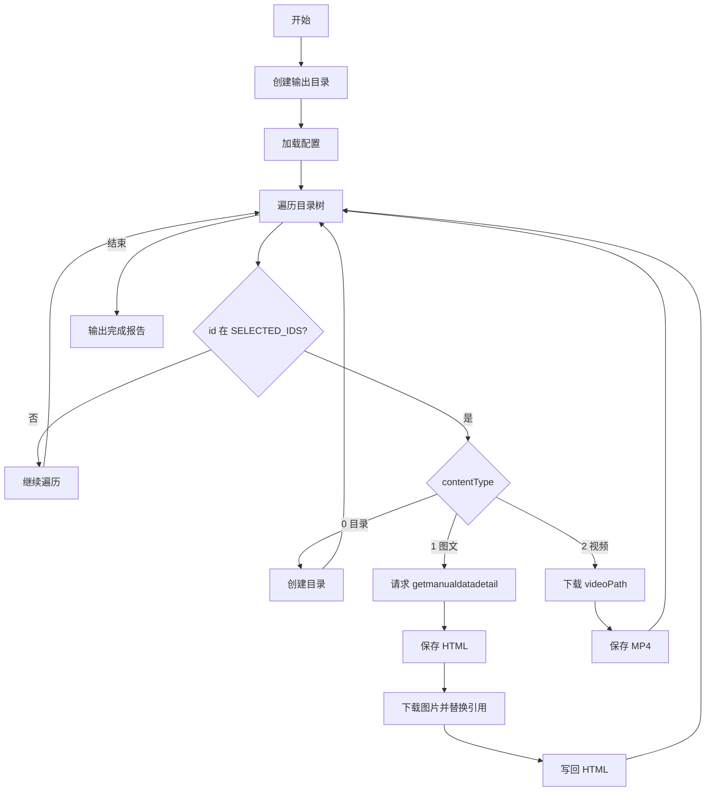

# 批量下载工具 — 技术方案

## 1. 技术栈与项目约定

- **技术栈**: Vue 3.5 + TypeScript 5.7 + Pinia 3.0 + Vue Router 4 + TailwindCSS 3.4 + Monaco Editor 0.52
- **构建工具**: Vite 6.2
- **遵循项目已有模式**:
  - Pinia 使用 Composition API 风格 (`defineStore`) → 参考 `stores/yaml-converter.ts`
  - 路由使用懒加载 `() => import(...)` → 参考 `router/index.ts`
  - 组件命名 PascalCase, 文件命名 PascalCase.vue → 参考 `components/json/`
  - 工具页面统一放在 `views/` 目录, 复杂组件放在 `components/{功能名}/` 目录
  - 使用 `@/` 路径别名 → 参考已有 import

## 2. 整体方案说明

本功能共分三部分交付：

| 部分 | 说明 | 交付形式 |
|------|------|---------|
| **SaaSSY 下载器配置生成器** | Web UI 配置 Cookie/目录 JSON → 生成 `download_saasyy.py` 脚本 | DevToolBox 双模式工具页面 |
| **通用网页抓取配置生成器** | Web UI 配置入口 URL + CSS 选择器 → 扫描文章 → 生成 `scrape_generic.py` 脚本 | DevToolBox 双模式工具页面 |
| **HTML 转 PDF 工具** | Web UI 粘贴/导入 HTML → 预览 → 导出为 PDF | DevToolBox 新工具页面 |

**双模式工具使用路径：**
1. 用户选择模式（SaaSSY 预设 / 通用网页抓取）
2. 根据模式填写对应的配置信息
3. 点击"扫描/解析"预览可下载内容
4. 勾选需要的内容，生成并下载 Python 脚本
5. 本地执行脚本下载内容

## 3. 数据模型与类型定义

### 3.1 目录节点类型 (新增到 `types/index.ts`)

```typescript
// SaaSSY 目录树节点（来自 API 响应）
export interface CatalogNode {
  id: number
  title: string
  contentType: 0 | 1 | 2   // 0=目录, 1=图文, 2=视频
  videoPath?: string        // contentType=2 时存在
  children?: CatalogNode[]
}

// 目录 API 响应结构
export interface CatalogResponse {
  status: boolean
  error: string
  list: CatalogNode[]
}

// 前端 UI 树节点（扩展了 UI 状态）
export interface TreeNode extends CatalogNode {
  uiId: string              // 唯一标识
  checked: boolean          // 当前勾选状态
  indeterminate: boolean    // 半选状态（部分子项勾选）
  expanded: boolean         // 展开/折叠
  uiChildren?: TreeNode[]   // 前端处理后的子节点
}

// 认证配置
export interface AuthConfig {
  cookie: string
  accessProfile: string
}

// 统计信息
export interface CatalogStats {
  totalDirs: number
  totalArticles: number
  totalVideos: number
  selectedArticles: number
  selectedVideos: number
}

// ====== 通用网页抓取模式 ======

// 通用抓取配置
export interface GenericScrapingConfig {
  entryUrl: string
  linkSelector: string      // 文章链接 CSS 选择器，如 'a[href*="/doc/cate-68/doc-"]'
  titleSelector: string     // 文章标题 CSS 选择器，如 'h1'
  contentSelector: string   // 正文内容 CSS 选择器，如 '.article-content'
  paginationSelector: string // 翻页链接 CSS 选择器，可选
  cookie: string            // 可选，用于需要登录的站点
  extraHeaders: string      // 额外请求头 JSON 字符串，可选
}

// 扫描到的文章元信息
export interface ScrapedArticle {
  url: string               // 文章完整 URL
  title: string             // 文章标题（选自列表页的文本）
  checked: boolean          // 是否勾选
  id: string                // 唯一标识（基于 URL 生成）
}

// 通用抓取扫描结果
export interface ScrapingResult {
  articles: ScrapedArticle[]
  error: string | null
  totalCount: number
}
```

### 3.2 导出脚本的运行时配置结构

脚本内嵌的运行时配置 JSON：

```json
{
  "cookie": "用户填入的 Cookie",
  "accessProfile": "用户填入的 accessProfile",
  "outputDir": "./SaaSSY教程",
  "catalog": [ /* 完整目录树 JSON */ ],
  "selectedIds": [101, 102, 203],
  "extraHeaders": {}
}
```

- `selectedIds`: 只包含用户已勾选的 contentType=1 或 2 的节点 id
- 运行时遍历 catalog，只处理 id 在 selectedIds 中的节点
- contentType=0 的目录：如果其下有子节点在 selectedIds 中则创建目录

## 4. Pinia Store 设计

### 4.1 `stores/saasyy-downloader.ts`

**状态（SaaSSY 模式原有 + 通用模式新增）：**

| 字段 | 类型 | 说明 | 对应 AC |
|------|------|------|---------|
| `mode` | `'saasyy' \| 'generic'` | 当前模式 | AC-021 |
| `authConfig` | `AuthConfig` | Cookie + accessProfile，初始化时从 localStorage 读取 | AC-016, AC-017 |
| `rawCatalogJson` | `string` | 用户粘贴的原始目录 JSON | AC-001 |
| `treeData` | `TreeNode[]` | 解析后的树结构 | AC-001 |
| `selectedIds` | `Set<number>` | 当前勾选的节点 id 集合 | AC-002~004 |
| `parseError` | `string \| null` | JSON 解析错误信息 | AC-010, AC-011 |
| `isParsing` | `boolean` | 解析中的 loading 状态 | - |
| `genericConfig` | `GenericScrapingConfig` | 通用抓取配置 | AC-021, AC-034, AC-035 |
| `scrapedArticles` | `ScrapedArticle[]` | 扫描到的文章列表 | AC-022 |
| `scrapingError` | `string \| null` | 扫描错误信息 | AC-028~030 |
| `isScanning` | `boolean` | 扫描中的 loading 状态 | - |
| `selectedArticleIds` | `Set<string>` | 已勾选的文章 id 集合 | AC-023 |

**计算属性：**

| 字段 | 说明 |
|------|------|
| `stats` | `CatalogStats`：实时统计总数和已选数 |
| `isConfigValid` | Cookie 和 accessProfile 均非空（SaaSSY 模式）；通用模式: 入口 URL 和必要选择器非空 |
| `hasSelection` | `selectedIds.size > 0` 或 `selectedArticleIds.size > 0` |
| `isCatalogReady` | `treeData.length > 0` 且无解析错误 |
| `articleCount` | 通用模式：总文章数和已选数 |

**核心方法：**

| 方法 | 说明 | 对应 AC |
|------|------|---------|
| `parseCatalog()` | 验证 JSON → 解析 → 递归构建 TreeNode[] | AC-001, AC-010, AC-011 |
| `toggleNode(uiId)` | 切换勾选状态，级联更新子节点和父节点 | AC-002~004 |
| `selectAll()` / `deselectAll()` | 全选/全不选 | AC-002 |
| `saveAuthConfig()` / `loadAuthConfig()` | localStorage 读写 | AC-016, AC-017 |
| `scanArticles()` | 请求入口 URL → 解析 HTML → 提取文章链接 → 填充 scrapedArticles | AC-022, AC-027~030 |
| `toggleArticle(id)` | 切换文章勾选 | AC-023 |
| `selectAllArticles()` / `deselectAllArticles()` | 全选/全不选文章 | - |
| `saveGenericConfig()` / `loadGenericConfig()` | 通用配置 localStorage 读写 | AC-034, AC-035 |
| `generateScript()` | 根据当前模式生成对应的 Python 脚本内容并触发下载 | AC-005, AC-024 |

**级联勾选算法：**
```
toggleNode(uiId):
  1. 切换该节点的 checked
  2. 级联向下：所有子节点 checked = 父节点的 checked
  3. 级联向上：父节点.checked = 所有子节点均为 true
             父节点.indeterminate = 部分子节点为 true
```

### 4.2 `stores/html-to-pdf.ts`

**状态：**

| 字段 | 类型 | 说明 |
|------|------|------|
| `htmlContent` | `string` | 用户输入的 HTML 内容 |
| `htmlTitle` | `string` | 从 HTML 中提取的标题（用于 PDF 文件名） |
| `pageSize` | `'A4' \| 'Letter' \| 'Legal'` | PDF 页面大小，默认 A4 |
| `margin` | `number` | PDF 页边距（mm），默认 10 |

**方法：**

| 方法 | 说明 |
|------|------|
| `setHtmlContent(val)` | 设置 HTML 内容并自动提取 `<title>` |
| `loadHtmlFile(file)` | 读取本地 .html 文件内容 |
| `exportPdf()` | 通过 iframe 渲染 → `window.print()` 触发浏览器 PDF 导出 |

## 5. 路由与导航

### 新增路由

```typescript
{
  path: '/saasyy-downloader',
  name: 'saasyy-downloader',
  component: () => import('@/views/SaasyyDownloaderTool.vue'),
  meta: { title: 'SaaSSY 下载器', icon: '⬇' },
},
{
  path: '/html-to-pdf',
  name: 'html-to-pdf',
  component: () => import('@/views/HtmlToPdfTool.vue'),
  meta: { title: 'HTML 转 PDF', icon: '📄' },
},
```

### 导航更新

- **AppHeader.vue**: 新增 "SaaSSY" 和 "HTML转PDF" 两个导航按钮
- **AppSidebar.vue**: 新增对应菜单项

## 6. 组件设计与数据流

### 6.1 双模式下载器组件树

```
SaasyyDownloaderTool.vue (主视图，布局容器)
├── ModeSelector.vue                 ← 模式选择器 (tabs: "SaaSSY 预设" / "通用网页抓取")
│
├── [SaaSSY 预设模式]
│   ├── AuthConfigPanel.vue          ← 认证配置 + 目录 JSON
│   │   ├── Cookie 输入框 (textarea)
│   │   ├── accessProfile 输入框 (textarea)
│   │   ├── 目录 JSON 输入框 (textarea)
│   │   └── 获取指引折叠面板
│   └── CatalogTreePanel.vue         ← 目录树预览
│       ├── 全选/取消全选工具栏
│       ├── 统计信息条 (CatalogStatsBar)
│       └── CatalogTreeNode.vue (递归)
│           └── CatalogTreeNode.vue (递归)
│
├── [通用网页抓取模式]
│   ├── GenericScrapingConfig.vue    ← 通用抓取配置 (新增)
│   │   ├── 入口 URL 输入框
│   │   ├── 文章链接 CSS 选择器输入
│   │   ├── 文章标题 CSS 选择器输入
│   │   ├── 正文内容 CSS 选择器输入
│   │   ├── 翻页 CSS 选择器输入（可选）
│   │   ├── Cookie 输入框（可选）
│   │   └── "扫描文章" 按钮
│   └── ArticleListPanel.vue         ← 扫描结果文章列表 (新增)
│       ├── 全选/取消全选工具栏
│       ├── 文章列表（含 checkbox + 标题 + URL）
│       └── 统计信息
│
└── ScriptGeneratorBar.vue           ← 底部脚本生成栏 (适配双模式)
    └── "生成并下载脚本" 按钮
```

### 6.2 HTML 转 PDF 组件树

```
HtmlToPdfTool.vue (主视图)
├── 顶部工具栏
│   ├── MonacoEditor (左侧, HTML 输入)
│   └── 预览面板 (右侧, iframe 渲染)
├── 页面设置栏
│   ├── 页面大小选择 (A4/Letter/Legal)
│   └── 边距设置
├── 底部操作栏
│   ├── "导入 HTML 文件" 按钮
│   └── "导出 PDF" 按钮
```

### 6.3 SaaSSY 模式数据流（不变）

```
用户输入 Cookie/AccessProfile
       ↓
  authConfig (store) ──→ localStorage
       ↓
用户粘贴目录 JSON → 点击"解析"
       ↓
  rawCatalogJson → parseCatalog() → treeData (store)
       ↓
  treeData → CatalogTreePanel + CatalogTreeNode (递归渲染)
       ↓
  用户勾选/取消 → toggleNode() → selectedIds (store)
       ↓
  stats (computed) → CatalogStatsBar (实时显示)
       ↓
  点击"生成并下载脚本" → generateScript('saasyy')
       ↓
  Python 脚本内容 → Blob URL → 浏览器下载 download_saasyy.py
```

### 6.4 通用网页抓取模式数据流（新增）

```
用户切换至通用模式
       ↓
  genericConfig (store) ← loadGenericConfig() (localStorage)
       ↓
用户填写入口 URL、CSS 选择器 → 配置自动保存到 localStorage
       ↓
点击"扫描文章"
       ↓
  scanArticles() → fetch(entryUrl) → 解析 HTML → extractLinks()
       ↓
  scrapedArticles[] ← 文章列表（标题 + URL）
       ↓
  ArticleListPanel 渲染 → 用户勾选文章
       ↓
  toggleArticle(id) → selectedArticleIds (store)
       ↓
  点击"生成并下载脚本" → generateScript('generic')
       ↓
  Python 脚本内容 → Blob URL → 浏览器下载 scrape_generic.py
```

## 7. Python 脚本模板设计

### 7.1 图片离线化核心算法

```python
import re
import os
import requests
import urllib.parse

def download_images_and_replace(html_content, base_dir):
    """
    1. 解析 HTML 中所有  标签
    2. 下载图片到 base_dir/images/ 目录
    3. 替换 HTML 中 src 为本地相对路径
    4. 返回替换后的 HTML
    """
    img_dir = os.path.join(base_dir, "images")
    os.makedirs(img_dir, exist_ok=True)

    def replace_img_src(match):
        tag = match.group(0)
        src_match = re.search(r'src=["\']([^"\']+)["\']', tag)
        if not src_match:
            return tag

        original_url = src_match.group(1)
        if not original_url.startswith('http'):
            return tag

        parsed = urllib.parse.urlparse(original_url)
        filename = os.path.basename(parsed.path)
        if not filename or '.' not in filename:
            filename = f"img_{hash(original_url) & 0xFFFFFFFF}.png"

        local_path = os.path.join(img_dir, filename)
        if os.path.exists(local_path):
            local_src = f"images/{filename}"
            return tag.replace(f'src="{original_url}"', f'src="{local_src}"') \
                       .replace(f"src='{original_url}'", f"src='{local_src}'")

        try:
            r = requests.get(original_url, stream=True, timeout=30)
            if r.status_code == 200:
                with open(local_path, 'wb') as f:
                    for chunk in r.iter_content(8192):
                        f.write(chunk)
                local_src = f"images/{filename}"
                return tag.replace(f'src="{original_url}"', f'src="{local_src}"') \
                           .replace(f"src='{original_url}'", f"src='{local_src}'")
        except:
            print(f"  图片下载失败: {original_url}")
        return tag

    html_content = re.sub(r']+>', replace_img_src, html_content)
    return html_content
```

### 7.2 脚本运行流程图



### 7.3 通用网页抓取 Python 脚本模板（新增）

**文件**: `src/components/saasyy-downloader/genericScriptTemplate.ts`（新建）
**函数**: `generateGenericScriptContent(config: GenericScrapingConfig, selectedArticles: ScrapedArticle[])`

生成的脚本 `scrape_generic.py` 使用 `requests` + `beautifulsoup4`：

```python
# -*- coding: utf-8 -*-
# 通用网页批量下载脚本
# 依赖: pip install requests beautifulsoup4

import requests
from bs4 import BeautifulSoup
import json
import os
import re
import time
import urllib.parse

# ========== 配置区 ==========
ENTRY_URL = "{{ENTRY_URL}}"
LINK_SELECTOR = "{{LINK_SELECTOR}}"
TITLE_SELECTOR = "{{TITLE_SELECTOR}}"
CONTENT_SELECTOR = "{{CONTENT_SELECTOR}}"
PAGINATION_SELECTOR = "{{PAGINATION_SELECTOR}}"
COOKIE = "{{COOKIE}}"
OUTPUT_DIR = "./downloaded_content"
EXTRA_HEADERS = {{EXTRA_HEADERS}}

# 已选文章 URL 列表
SELECTED_URLS = {{SELECTED_URLS}}
# ============================

session = requests.Session()
session.headers.update({
    'User-Agent': 'Mozilla/5.0 (Windows NT 10.0; Win64; x64) AppleWebKit/537.36',
})
if COOKIE:
    session.headers['Cookie'] = COOKIE
session.headers.update(EXTRA_HEADERS)

def log(msg):
    print(f"[Scraper] {msg}")

def download_file(url, filepath, retry=3):
    for i in range(retry):
        try:
            r = session.get(url, stream=True, timeout=30)
            if r.status_code == 200:
                os.makedirs(os.path.dirname(filepath), exist_ok=True)
                with open(filepath, 'wb') as f:
                    for chunk in r.iter_content(8192):
                        f.write(chunk)
                return True
        except:
            if i < retry - 1:
                time.sleep(2)
    return False

def resolve_url(base_url, href):
    """将相对 URL 解析为绝对 URL，考虑 <base> 标签"""
    if href.startswith('http://') or href.startswith('https://'):
        return href
    return urllib.parse.urljoin(base_url, href)

def download_images_and_replace(html_content, base_dir, page_url):
    """下载图片并替换 src 为本地路径"""
    img_dir = os.path.join(base_dir, "images")
    os.makedirs(img_dir, exist_ok=True)
    
    soup = BeautifulSoup(html_content, 'html.parser')
    base_tag = soup.find('base')
    base_url = base_tag.get('href', page_url) if base_tag else page_url
    
    for img in soup.find_all('img'):
        src = img.get('src')
        if not src:
            continue
        abs_url = resolve_url(base_url, src)
        if not abs_url.startswith('http'):
            continue
        parsed = urllib.parse.urlparse(abs_url)
        filename = os.path.basename(parsed.path)
        if not filename or '.' not in filename:
            filename = f"img_{hash(abs_url) & 0xFFFFFFFF}.png"
        local_path = os.path.join(img_dir, filename)
        if not os.path.exists(local_path):
            download_file(abs_url, local_path)
        img['src'] = f"images/{filename}"
    
    return str(soup)

def scrape_article(url, output_dir):
    log(f"下载文章: {url}")
    try:
        r = session.get(url, timeout=30)
        r.encoding = r.apparent_encoding
        if r.status_code != 200:
            log(f"  请求失败: HTTP {r.status_code}")
            return False
    except Exception as e:
        log(f"  请求异常: {e}")
        return False
    
    soup = BeautifulSoup(r.text, 'html.parser')
    
    # 提取标题
    title_el = soup.select_one(TITLE_SELECTOR) if TITLE_SELECTOR else None
    title = title_el.get_text(strip=True) if title_el else "untitled"
    safe_title = re.sub(r'[\\\\/*?:"<>|]', '', title).strip()
    if not safe_title:
        safe_title = f"article_{hash(url) & 0xFFFFFFFF}"
    
    # 提取正文
    content_el = soup.select_one(CONTENT_SELECTOR) if CONTENT_SELECTOR else soup.body
    if not content_el:
        log(f"  未找到正文内容 (选择器: {CONTENT_SELECTOR})")
        return False
    
    article_html = str(content_el)
    article_html = download_images_and_replace(article_html, output_dir, url)
    
    full_html = f"""<!DOCTYPE html>
<html lang="zh-CN">
<head>
    <meta charset="UTF-8">
    <title>{title}</title>
</head>
<body>
    <h1>{title}</h1>
    {article_html}
</body>
</html>"""
    
    filepath = os.path.join(output_dir, f"{safe_title}.html")
    os.makedirs(output_dir, exist_ok=True)
    with open(filepath, 'w', encoding='utf-8') as f:
        f.write(full_html)
    log(f"  已保存: {filepath}")
    return True

def scrape_listing(url, link_selector, pagination_selector=None):
    """扫描列表页，返回所有文章链接"""
    log(f"扫描列表页: {url}")
    try:
        r = session.get(url, timeout=30)
        r.encoding = r.apparent_encoding
        if r.status_code != 200:
            log(f"  请求失败: HTTP {r.status_code}")
            return [], None
    except Exception as e:
        log(f"  请求异常: {e}")
        return [], None
    
    soup = BeautifulSoup(r.text, 'html.parser')
    links = soup.select(link_selector)
    articles = []
    for a in links:
        href = a.get('href')
        text = a.get_text(strip=True)
        if href and text:
            full_url = resolve_url(url, href)
            articles.append({'url': full_url, 'title': text})
    
    # 翻页
    next_url = None
    if pagination_selector:
        next_el = soup.select_one(pagination_selector)
        if next_el:
            next_href = next_el.get('href')
            if next_href:
                next_url = resolve_url(url, next_href)
    
    return articles, next_url

def main():
    os.makedirs(OUTPUT_DIR, exist_ok=True)
    log(f"输出目录: {OUTPUT_DIR}")
    log(f"已选文章: {len(SELECTED_URLS)} 篇")
    
    for i, article_url in enumerate(SELECTED_URLS, 1):
        log(f"[{i}/{len(SELECTED_URLS)}]")
        scrape_article(article_url, OUTPUT_DIR)
    
    log("全部下载完成！")

if __name__ == '__main__':
    main()
```

**验证标准：**
1. 生成的脚本是合法 Python 语法
2. 配置区可找到完整的 ENTRY_URL、SELECTORS、SELECTED_URLS
3. 模板中所有 `{{...}}` 占位符被替换
4. 包含 `download_images_and_replace` 的完整实现（使用 BeautifulSoup 解析）
5. 脚本不包含任何 SaaSSY 相关的硬编码

## 8. HTML 转 PDF 工具实现方案

### 8.1 技术选型

**零依赖方案**：利用浏览器自带的打印功能实现 PDF 导出。

原理：
1. 将用户输入的 HTML 渲染到隐藏的 `<iframe>` 中
2. 通过 postMessage 触发 iframe 内的 `window.print()` 
3. 用户在"打印"对话框中选择"另存为 PDF"（Chrome/Edge 内置）

**替代方案（备选）**：如果用户需要更便捷的一键导出，后续可引入 `html2canvas` + `jsPDF`。

### 8.2 核心实现

```vue
<script setup lang="ts">
import { ref, computed, watch } from 'vue'
import { useHtmlToPdfStore } from '@/stores/html-to-pdf'
import MonacoEditor from '@/components/json/MonacoEditor.vue'

const store = useHtmlToPdfStore()
const iframeRef = ref<HTMLIFrameElement>()

function onHtmlChange(value: string) {
  store.setHtmlContent(value)
  updatePreview()
}

function updatePreview() {
  if (!iframeRef.value || !store.htmlContent) return
  const doc = iframeRef.value.contentDocument
  if (!doc) return
  doc.open()
  doc.write(store.htmlContent)
  doc.close()
}

function importHtmlFile() {
  const input = document.createElement('input')
  input.type = 'file'
  input.accept = '.html,.htm'
  input.onchange = async (e) => {
    const file = (e.target as HTMLInputElement).files?.[0]
    if (!file) return
    const text = await file.text()
    store.setHtmlContent(text)
    updatePreview()
  }
  input.click()
}

function exportPdf() {
  if (!iframeRef.value) return
  // 向 iframe 发送打印指令
  iframeRef.value.contentWindow?.print()
}
</script>
```

### 8.3 打印样式优化

在渲染到 iframe 时，自动注入打印专用的 CSS：

```css
@media print {
  @page {
    size: {{pageSize}};
    margin: {{margin}}mm;
  }
  body {
    font-family: 'Inter', system-ui, sans-serif;
    font-size: 12pt;
    line-height: 1.6;
    color: #000;
  }
  img { max-width: 100%; }
  a { text-decoration: none; color: inherit; }
  pre, code { font-family: 'JetBrains Mono', monospace; font-size: 10pt; }
}
```

## 9. UI 布局方案

### 9.1 双模式切换与 SaaSSY 预设模式

```
┌──────────────────────────────────────────────────────┐
│  状态栏: SaaSSY 学习资料批量下载器                    │
├──────────────────────────────────────────────────────┤
│  左栏 (40%)           │        右栏 (60%)            │
│  ┌────────────────┐   │  ┌──────────────────────┐   │
│  │ 认证配置        │   │  │ 目录 JSON 输入        │   │
│  │ Cookie: [...]  │   │  │ (Monaco Editor)       │   │
│  │ AccessProfile  │   │  │                       │   │
│  │               │   │  │  [📋 解析目录]         │   │
│  │ [获取指引 ▾]   │   │  └──────────────────────┘   │
│  └────────────────┘   │                              │
│  ┌────────────────┐   │                              │
│  │ 统计信息        │   │                              │
│  │ 📁 3 目录       │   │                              │
│  │ 📄 12 图文      │   │                              │
│  │ 🎬 6 视频       │   │                              │
│  └────────────────┘   │                              │
├────────────────────────┴──────────────────────────────┤
│  底部: [⬇ 生成并下载脚本]   已勾选 10/18 个文件       │
└───────────────────────────────────────────────────────┘
```

解析成功后，右栏切换为目录树预览：

```
┌──────────────────────────────────────────────────────┐
│  状态栏: SaaSSY 学习资料批量下载器                    │
├──────────────────────────────────────────────────────┤
│  左栏 (40%)           │        右栏 (60%)            │
│  ┌────────────────┐   │  ┌──────────────────────┐   │
│  │ 认证配置 [✓]   │   │  │ ☑ 全选  ☐ 取消全选   │   │
│  └────────────────┘   │  │  [🔄 重新解析]        │   │
│  ┌────────────────┐   │  ├──────────────────────┤   │
│  │ 统计信息        │   │  │ ☑ 📁 工作台           │   │
│  │ 总计: 3/12/6   │   │  │ ├─ ☑ 📄 工作台       │   │
│  │ 已选: 2/8/4    │   │  │ ☑ 📁 资料            │   │
│  └────────────────┘   │  │ ├─ ☑ 📄 基础资料     │   │
│                      │   │ ├─ ☐ 📄 其他设置     │   │
│                      │   │ ☑ 📁 培训视频        │   │
│                      │   │ ├─ ☑ 🎬 基础设置     │   │
│                      │   │ └─ ☐ 🎬 扩展功能     │   │
└──────────────────────┴───────────────────────────────┘
│  底部: [⬇ 生成并下载脚本]   已勾选 8/15 个文件       │
└──────────────────────────────────────────────────────┘
```

### 9.2 通用网页抓取模式布局（新增）

```
┌──────────────────────────────────────────────────────────┐
│  状态栏: ⬇ 批量下载器    [SaaSSY 预设] [● 通用网页抓取] │
├──────────────────────────────────────────────────────────┤
│  左栏 (40%)              │        右栏 (60%)             │
│  ┌────────────────────┐  │  ┌────────────────────────┐  │
│  │ 入口 URL            │  │  │ 文章列表               │  │
│  │ [https://www.chan 〗│  │  │ ☑ 全选  ☐ 取消全选    │  │
│  └────────────────────┘  │  │                        │  │
│  ┌────────────────────┐  │  │ ├─ ☑ 凌晨时服务会自动… │  │
│  │ 文章链接 CSS 选择器 │  │  │ ├─ ☑ 物料清单导出缺…  │  │
│  │ a[href*="/doc/cate]│  │  │ ├─ ☐ 如何实现不录入…  │  │
│  └────────────────────┘  │  │ ├─ ☑ 如何使用业务流…  │  │
│  ┌────────────────────┐  │  │ └─ ☐ ... 更多          │  │
│  │ 文章标题 CSS 选择器 │  │  │                        │  │
│  │ h1                 │  │  │  共扫描到 24 篇文章    │  │
│  └────────────────────┘  │  │                        │  │
│  ┌────────────────────┐  │  └────────────────────────┘  │
│  │ 正文内容 CSS 选择器 │  │                              │
│  │ .article-content   │  │                              │
│  └────────────────────┘  │                              │
│  ┌────────────────────┐  │                              │
│  │ 翻页选择器（可选）  │  │                              │
│  │ .pagination .next  │  │                              │
│  └────────────────────┘  │                              │
│  ┌────────────────────┐  │                              │
│  │ Cookie（可选）      │  │                              │
│  │ [................]  │  │                              │
│  └────────────────────┘  │                              │
│                          │                              │
│  [🔍 扫描文章]           │                              │
│  ┌────────────────────┐  │                              │
│  │ 扫描结果: 24 篇     │  │                              │
│  │ 已选: 18 篇         │  │                              │
│  └────────────────────┘  │                              │
├──────────────────────────┴──────────────────────────────┤
│  底部: [⬇ 生成并下载脚本]   已勾选 18/24 篇文章          │
└──────────────────────────────────────────────────────────┘
```

### 9.3 HTML 转 PDF

```
┌──────────────────────────────────────────────────────┐
│  状态栏: HTML 转 PDF — 粘贴或导入 HTML 文件          │
├──────────────────────────────────────────────────────┤
│  左栏 (HTML 编辑, 50%) │  右栏 (实时预览, 50%)      │
│  ┌──────────────────┐  │  ┌──────────────────────┐  │
│  │   Monaco Editor   │  │  │   <iframe> 渲染      │  │
│  │   (HTML)          │  │  │   所见即所得预览     │  │
│  │                   │  │  │                      │  │
│  └──────────────────┘  │  └──────────────────────┘  │
│                        │                             │
├────────────────────────┴─────────────────────────────┤
│  页面: [A4 ▼]  边距: [10mm]                         │
│  [📂 导入文件]                          [🖨 导出 PDF] │
└──────────────────────────────────────────────────────┘
```

## 10. AC 覆盖矩阵

### SaaSSY 下载器

| AC | 实现位置 | 实现方式 |
|----|---------|---------|
| AC-001 | `CatalogJsonInput.vue` + `store.parseCatalog()` | Monaco 编辑 → 解析 → treeData |
| AC-002 | `CatalogTreeNode.vue` + `store.toggleNode()` | checkbox 级联 |
| AC-003 | `CatalogTreeNode.vue` + `store.toggleNode()` | 取消级联 |
| AC-004 | `CatalogTreeNode.vue` | indeterminate 属性 + CSS |
| AC-005 | `ScriptGeneratorBar.vue` + `store.generateScript()` | Blob 下载 .py 文件 |
| AC-006 | Python 脚本 `main()` | selected_ids 运行时过滤 |
| AC-007 | `download_images_and_replace()` | re.sub + requests 下载 |
| AC-008 | `download_video()` | requests 流式下载 |
| AC-009 | 整体脚本 | 图片离线化实现完全离线可看 |
| AC-010 | `store.parseCatalog()` try-catch | JSON 语法错误提示 |
| AC-011 | `store.parseCatalog()` 字段校验 | status 和 list 字段验证 |
| AC-012 | `ScriptGeneratorBar.vue` | disabled 绑定 `!isConfigValid` |
| AC-013 | `ScriptGeneratorBar.vue` | disabled 绑定 `!hasSelection` |
| AC-014 | Python `download_article()` | 3 次重试 + try-catch |
| AC-015 | Python `download_file()` | 3 次重试 + try-catch |
| AC-016 | `store.loadAuthConfig()` | localStorage.getItem |
| AC-017 | `store.saveAuthConfig()` | localStorage.setItem |
| AC-018 | Python 脚本配置区 | 完整目录树 + selected_ids |
| AC-019 | `download_images_and_replace()` | images/ 目录 + src 替换 |
| AC-020 | Python `process_node()` | contentType 0/1/2 分支 |

### 通用网页抓取模式（新增 AC）

| AC | 实现位置 | 实现方式 |
|----|---------|---------|
| AC-021 | `GenericScrapingConfig.vue` | 6 个配置输入框渲染 |
| AC-022 | `store.scanArticles()` + `ArticleListPanel.vue` | fetch URL → BeautifulSoup 解析 → 提取链接 |
| AC-023 | `ArticleListPanel.vue` + `store.toggleArticle()` | checkbox 勾选 |
| AC-024 | `ScriptGeneratorBar.vue` + `store.generateScript('generic')` | Blob 下载 scrape_generic.py |
| AC-025 | Python `scrape_article()` | requests 请求 + BeautifulSoup 提取 |
| AC-026 | Python `download_images_and_replace()` | BeautifulSoup 解析 img → 下载 → 替换 |
| AC-027 | Python `scrape_listing()` + 翻页循环 | 递归翻页 |
| AC-028 | `store.scanArticles()` 前置校验 | URL 正则验证 |
| AC-029 | `store.scanArticles()` try-catch | 请求异常捕获 |
| AC-030 | `ArticleListPanel.vue` | 空列表提示 |
| AC-031 | `GenericScrapingConfig.vue` | 按钮 disabled 绑定 |
| AC-032 | `ScriptGeneratorBar.vue` | disabled 绑定 `!hasSelection` |
| AC-033 | Python `scrape_article()` | 3 次重试 + try-catch |
| AC-034 | `store.loadGenericConfig()` | localStorage.getItem |
| AC-035 | `store.saveGenericConfig()` | localStorage.setItem |
| AC-036 | Python 脚本注释 | pip install 说明 |
| AC-037 | Python `resolve_url()` + `<base>` 处理 | urllib.parse.urljoin |
| AC-038 | Python `soup.select()` | BeautifulSoup 标准 select

### HTML 转 PDF（已存在，AC 编号调整为 101+）

| AC | 说明 | 实现方式 |
|----|------|---------|
| AC-101 | Given 用户打开 HTML 转 PDF 工具，When 粘贴 HTML 代码到编辑器，Then 右侧实时渲染预览 | Monaco + iframe srcdoc |
| AC-102 | Given 用户有本地 .html 文件，When 点击"导入文件"，Then 文件内容加载到编辑器并刷新预览 | FileReader + Monaco |
| AC-103 | Given HTML 已加载到预览，When 点击"导出 PDF"，Then 浏览器打开打印对话框，预设 A4 纸张和合适边距 | iframe.contentWindow.print() |
| AC-104 | Given 用户调整页面大小或边距设置，When 点击"导出 PDF"，Then 打印 CSS 中的 @page 规则相应变化 | 响应式 CSS 变量 |

## 11. 文件改动清单

### 原始文件（Phase 0~3）

| 文件 | 说明 |
|------|------|
| `src/types/index.ts` | 新增 `CatalogNode`, `TreeNode`, `AuthConfig`, `CatalogStats` 类型 |
| `src/stores/saasyy-downloader.ts` | SaaSSY 下载器 Store |
| `src/stores/html-to-pdf.ts` | HTML 转 PDF Store |
| `src/views/SaasyyDownloaderTool.vue` | SaaSSY 下载器主视图 |
| `src/views/HtmlToPdfTool.vue` | HTML 转 PDF 主视图 |
| `src/components/saasyy-downloader/AuthConfigPanel.vue` | 认证配置面板 |
| `src/components/saasyy-downloader/CatalogJsonInput.vue` | 目录 JSON 输入面板 |
| `src/components/saasyy-downloader/CatalogTreePanel.vue` | 目录树预览面板 |
| `src/components/saasyy-downloader/CatalogTreeNode.vue` | 递归树节点组件 |
| `src/components/saasyy-downloader/CatalogStatsBar.vue` | 统计信息条 |
| `src/components/saasyy-downloader/ScriptGeneratorBar.vue` | 底部脚本生成栏 |

### CR-001 变更文件（新增/修改）

| 文件 | 变更类型 | 说明 |
|------|---------|------|
| `src/types/index.ts` | 修改 | 新增 `GenericScrapingConfig`, `ScrapedArticle`, `ScrapingResult` 类型 |
| `src/stores/saasyy-downloader.ts` | 修改 | 新增 `mode`, `genericConfig`, `scrapedArticles`, `scrapingError`, `isScanning`, `selectedArticleIds` 状态；新增 `scanArticles()`, `toggleArticle()`, `selectAllArticles()`, `deselectAllArticles()`, `saveGenericConfig()`, `loadGenericConfig()` 方法；`generateScript()` 适配双模式 |
| `src/views/SaasyyDownloaderTool.vue` | 修改 | 添加模式选择器；左栏/右栏根据模式渲染不同组件 |
| `src/components/saasyy-downloader/ScriptGeneratorBar.vue` | 修改 | 适配双模式，显示不同统计信息和下载文件名 |
| `src/components/saasyy-downloader/GenericScrapingConfig.vue` | 新增 | 通用抓取配置面板（6 个配置项 + 扫描按钮） |
| `src/components/saasyy-downloader/ArticleListPanel.vue` | 新增 | 扫描结果文章列表（勾选/全选/统计） |
| `src/components/saasyy-downloader/genericScriptTemplate.ts` | 新增 | 通用抓取 Python 脚本模板 |
| `src/components/saasyy-downloader/pythonScriptTemplate.ts` | 不变 | SaaSSY 模式脚本模板不变 |
| `src/components/layout/AppSidebar.vue` | 修改 | 更新侧边栏分组名称从"SaaSSY 教程下载"为"批量下载" |

---
## 变更日志 (Change Log)
### CR-001: 新增通用网页抓取模式 (2026-05-09)
**变更类型**: 扩展
**变更原因**: 用户需要下载除 SaaSSY 之外的其他网站（如 chanjetvip.com）的内容
**变更内容**:
- §2 整体方案：从两部分交付改为三部分，新增"通用网页抓取配置生成器"
- §3 数据模型：新增 `GenericScrapingConfig`、`ScrapedArticle`、`ScrapingResult` 类型
- §4 Store：新增 mode 状态、通用抓取相关字段和方法
- §6 组件树：新增双模式结构，添加 `GenericScrapingConfig.vue`、`ArticleListPanel.vue` 组件
- §6.4 数据流：新增通用网页抓取模式数据流
- §7.3 脚本模板：新增通用抓取 Python 脚本模板（BeautifulSoup）
- §9 UI 布局：新增通用网页抓取模式布局
- §10 AC 矩阵：新增 AC-021~AC-038 覆盖矩阵，HTML 转 PDF AC 编号调整为 AC-101~104
- §11 文件清单：更新为原始文件 + CR-001 变更文件
