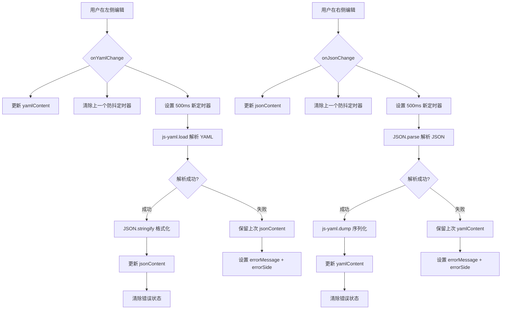

# YAML/JSON 互转工具 — 技术方案

## 1. 技术选型

| 决策项 | 选择 | 理由 |
|--------|------|------|
| YAML 解析库 | **js-yaml** | 最成熟的 JS YAML 库，支持锚点/别名/多文档，覆盖 K8s/CI-CD/OpenAPI 等场景 |
| 编辑器 | Monaco Editor（复用现有组件） | 项目已集成，需做一次解耦改造使其成为通用组件 |
| 状态管理 | Pinia（新增 store） | 遵循项目现有约定 |
| 语言模式 | Monaco 内置 yaml/json | 内置语法高亮，无需额外配置 |

---

## 2. MonacoEditor 组件解耦改造

### 现状问题

[MonacoEditor.vue](file:///d:/dev/常用web工具开发/tool-site/src/components/json/MonacoEditor.vue) 内部硬编码调用了 `jsonStore.updateContent()`：

```typescript
// 当前代码 — 在 onDidChangeModelContent 回调中
emit('update:modelValue', value)
jsonStore.updateContent(value)  // ← 硬耦合，YAML 转换器无法复用
```

### 改造方案

移除 `jsonStore` 依赖，改为纯 v-model 组件：

```typescript
// 改造后
editor.onDidChangeModelContent(() => {
  const value = editor.getValue()
  emit('update:modelValue', value)
  // jsonStore.updateContent(value)  ← 删除这行，交给父组件处理
})
```

同时删除组件内的 `import { useJsonEditorStore }` 和 `const jsonStore = ...`。

### 影响范围

- **MonacoEditor.vue**：移除 jsonStore 调用
- **JsonTool.vue**：在代码模式下监听 MonacoEditor 的 `update:modelValue` 事件，手动调用 `jsonStore.updateContent(value)`
- **JsonToolbar.vue** / **SearchReplace.vue**：这些组件通过 `jsonStore` 操作编辑器，不受影响（它们依赖 store，不是编辑器组件本身）

---

## 3. Pinia Store 设计

**文件**：`src/stores/yaml-converter.ts`

```typescript
// 核心状态
yamlContent: string      // 左侧编辑器内容
jsonContent: string      // 右侧编辑器内容
activeSide: 'yaml' | 'json'  // 当前正在编辑的一侧
yamlValid: boolean       // YAML 是否有效
jsonValid: boolean       // JSON 是否有效
errorMessage: string     // 错误信息
errorSide: 'yaml' | 'json' | null  // 错误发生在哪一侧
debounceTimer: number | null  // 防抖定时器
```

### 核心方法

| 方法 | 触发条件 | 对应 AC |
|------|----------|---------|
| `onYamlChange(value)` | 左侧内容变化 | AC-002 |
| `onJsonChange(value)` | 右侧内容变化 | AC-003 |
| `importFile(file)` | 点击导入按钮 | AC-004 |
| `exportFile(format)` | 点击导出按钮 | AC-005 |

### 转换流程（Mermaid）



### 关键逻辑说明

**防抖实现（500ms）**— 对应 AC-015：
```typescript
function debouncedConvert(action: () => void) {
  if (debounceTimer.value) clearTimeout(debounceTimer.value)
  debounceTimer.value = setTimeout(() => {
    action()
  }, 500) as unknown as number
}
```

**错误处理（保留上次结果）**— 对应 AC-009、AC-010：
```typescript
function yamlToJson(yaml: string): void {
  if (!yaml.trim()) {
    jsonContent.value = ''
    jsonValid.value = true
    errorMessage.value = ''
    return
  }
  try {
    const parsed = jsYaml.load(yaml)  // 支持多文档 → 返回数组
    jsonContent.value = JSON.stringify(parsed, null, 2)
    jsonValid.value = true
    errorMessage.value = ''
    errorSide.value = null
  } catch (e: any) {
    jsonValid.value = false  // 仅标记无效
    errorMessage.value = `YAML 解析错误: ${e.message}`
    errorSide.value = 'yaml'
    // jsonContent 保留上次有效值，不清空
  }
}
```

---

## 4. 组件结构

```
src/components/yaml-converter/
  YamlConverterView.vue     ← 左右分栏主视图（路由页面组件）
```

**YamlConverterView.vue 内部结构**：

```
┌────────────────────────────────────────────────────────────┐
│  ToolBarRow                                                  │
│  [导入] [导出]                             状态栏(有效/错误)  │
├──────────────────────────┬─────────────────────────────────┤
│  EditorPanel (左)         │  EditorPanel (右)                │
│  ┌────────────────────┐  │  ┌──────────────────────────┐   │
│  │  MonacoEditor       │  │  │  MonacoEditor             │   │
│  │  language: 'yaml'   │  │  │  language: 'json'         │   │
│  │  v-model: yaml      │  │  │  v-model: json            │   │
│  └────────────────────┘  │  └──────────────────────────┘   │
├──────────────────────────┴─────────────────────────────────┤
│  StatusBar                                                   │
│  YAML: 行:5 列:1 | JSON: 行:3 列:10 | 格式有效              │
└────────────────────────────────────────────────────────────┘
```

### 组件职责

| 组件 | 职责 |
|------|------|
| `YamlConverterView.vue` | 布局管理、导入/导出、状态同步、错误展示 |
| `MonacoEditor` (复用) | 编辑能力（已解耦为通用组件） |

不分拆更多小组件，因为当前功能足够聚焦，过度拆分反而增加复杂度。

---

## 5. 路由配置

**文件**：`src/router/index.ts`

```typescript
{
  path: '/yaml-json',
  name: 'yaml-json',
  component: () => import('@/views/YamlConverterTool.vue'),
  meta: {
    title: 'YAML/JSON 互转',
    icon: '⇄',
  },
}
```

**视图文件**：`src/views/YamlConverterTool.vue`（作为路由页面入口，引入 YamlConverterView）

---

## 6. 导航配置更新

**AppHeader.vue** — 新增导航项：

```typescript
{ id: 'yaml-json', name: 'YAML/JSON', icon: '⇄', route: '/yaml-json' }
```

**AppSidebar.vue** — 在"数据转换"分组下新增：

```typescript
{
  name: '数据转换',
  tools: [
    { id: 'json', name: 'JSON 编辑器', icon: '{ }', route: '/json', desc: '编辑、格式化、验证 JSON' },
    { id: 'yaml-json', name: 'YAML/JSON 互转', icon: '⇄', route: '/yaml-json', desc: 'YAML 与 JSON 双向实时转换' },
  ],
}
```

---

## 7. 文件导入/导出实现

### 导入（对应 AC-004）

```typescript
function importFile() {
  const input = document.createElement('input')
  input.type = 'file'
  input.accept = '.yaml,.yml,.json'
  input.onchange = async (e) => {
    const file = (e.target as HTMLInputElement).files?.[0]
    if (!file) return
    const text = await file.text()
    const ext = file.name.split('.').pop()?.toLowerCase()
    if (ext === 'yaml' || ext === 'yml') {
      store.onYamlChange(text)
      store.flushYamlToJson() // 立即转换
    } else if (ext === 'json') {
      store.onJsonChange(text)
      store.flushJsonToYaml() // 立即转换
    }
  }
  input.click()
}
```

### 导出（对应 AC-005）

```typescript
function exportFile(format: 'yaml' | 'json') {
  const content = format === 'yaml' ? store.yamlContent : store.jsonContent
  const ext = format === 'yaml' ? 'yaml' : 'json'
  const blob = new Blob([content], { type: 'text/plain' })
  const url = URL.createObjectURL(blob)
  const a = document.createElement('a')
  a.href = url
  a.download = `converted.${ext}`
  a.click()
  URL.revokeObjectURL(url)
}
```

---

## 8. AC 覆盖矩阵

| AC | 实现位置 | 说明 |
|----|----------|------|
| AC-001 | YamlConverterView.vue | 左右双栏布局，Monaco 语言模式分别设为 yaml/json |
| AC-002 | yaml-converter.ts → onYamlChange | YAML 输入 → 500ms 防抖 → js-yaml.load → JSON.stringify |
| AC-003 | yaml-converter.ts → onJsonChange | JSON 输入 → 500ms 防抖 → JSON.parse → js-yaml.dump |
| AC-004 | YamlConverterView.vue → importFile | 文件读取 → 扩展名判断 → 填入对应侧编辑器 |
| AC-005 | YamlConverterView.vue → exportFile | Blob 下载，文件名 converted.yaml/json |
| AC-006 | yaml-converter.ts → js-yaml.load | js-yaml.load 原生返回数组 |
| AC-007 | yaml-converter.ts → js-yaml.dump | 检测 parsed 是数组 → js-yaml.dump 带 --- 分隔 |
| AC-008 | yaml-converter.ts → js-yaml.load | js-yaml 原生展开锚点 |
| AC-009 | yaml-converter.ts → yamlToJson | catch 中不清空 jsonContent，仅设 errorMessage |
| AC-010 | yaml-converter.ts → jsonToYaml | catch 中不清空 yamlContent，仅设 errorMessage |
| AC-011 | YamlConverterView.vue → template | 顶部错误区域展示 errorMessage + errorSide |
| AC-012 | yaml-converter.ts → 空内容检查 | trim() 为空时双向清空 |
| AC-013 | YamlConverterView.vue → importFile | 文件大小 > 1MB 时弹提醒 |
| AC-014 | yaml-converter.ts → activeSide | 根据触发源决定转换方向 |
| AC-015 | yaml-converter.ts → debounce | setTimeout 500ms |
| AC-016 | YamlConverterView.vue → MonacoEditor | language="yaml" / language="json" |

---

## 9. js-yaml 安装

```bash
npm install js-yaml
npm install -D @types/js-yaml
```

---

## 10. 目录/文件变更清单

| 操作 | 文件 |
|------|------|
| **新增** | `src/views/YamlConverterTool.vue` |
| **新增** | `src/components/yaml-converter/YamlConverterView.vue` |
| **新增** | `src/stores/yaml-converter.ts` |
| **修改** | `src/components/json/MonacoEditor.vue`（移除 jsonStore 依赖） |
| **修改** | `src/views/JsonTool.vue`（适配解耦后的 MonacoEditor） |
| **修改** | `src/router/index.ts`（新增 YAML/JSON 路由） |
| **修改** | `src/components/layout/AppHeader.vue`（新增导航项） |
| **修改** | `src/components/layout/AppSidebar.vue`（新增侧边栏项） |
| **修改** | `package.json`（添加 js-yaml 依赖） |
